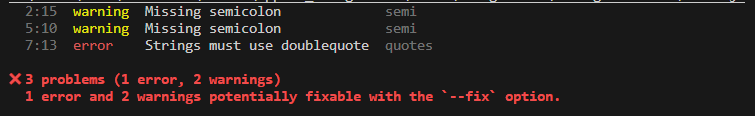

# Configuring ESLint in a Node.js Project

## Steps Followed
These are the steps I followed for configuring this project.
1. Initialized a new project using **npm init**.
2. Initialized eslint using **npm init @eslint/config**.
3. Added two rules in the *eslint.config.mjs* file, including setting **semi** to **warn** and **quotes** to **error**.
4. Created index.js with code that violates the rules.
5. Ran **npx eslint .\index.js** to verify that linter is working correctly.

## Issues Encountered
The main issue that I encountered is that the instructions said that the .eslintrc file would appear when it didn't. After a quick web search, it turns out that .eslintrc is not used by ESLint anymore, although it is compatible. Instead, eslint.config is used for the configuration file. I had to look up how to set rules for the eslint.config file in the ESLint docs.

## How ESLint Is Useful
ESLint can be incredibly useful for ensuring code quality because it can catch common syntax errors that make the code less readable. As a project grows, the code can become more convoluted. As such, readability and maintaining coding standards are imperative for when the next developer has to work on the project.

