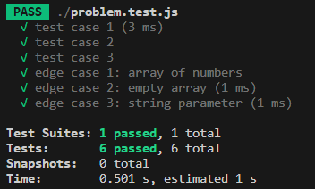
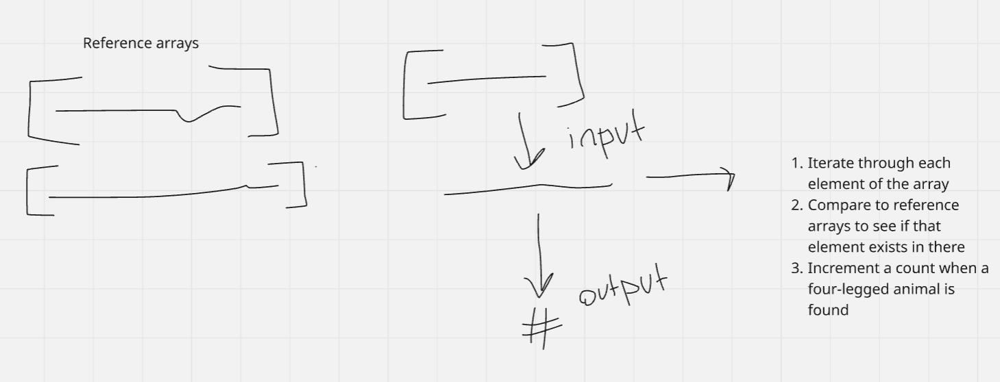

# Week 2: Animal Leg Count in the Forest

## Clarifying Questions
1. Do I need to account for animals with differently sized legs or only four-legged animals?
2. Are there specific edge cases that I should consider?
3. What is the goal for time and space complexity?

## Complexity
**Time:** O(n)
**Space:** O(n)

## Tests Passed

## Diagram
