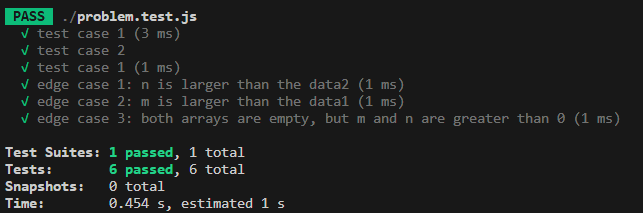
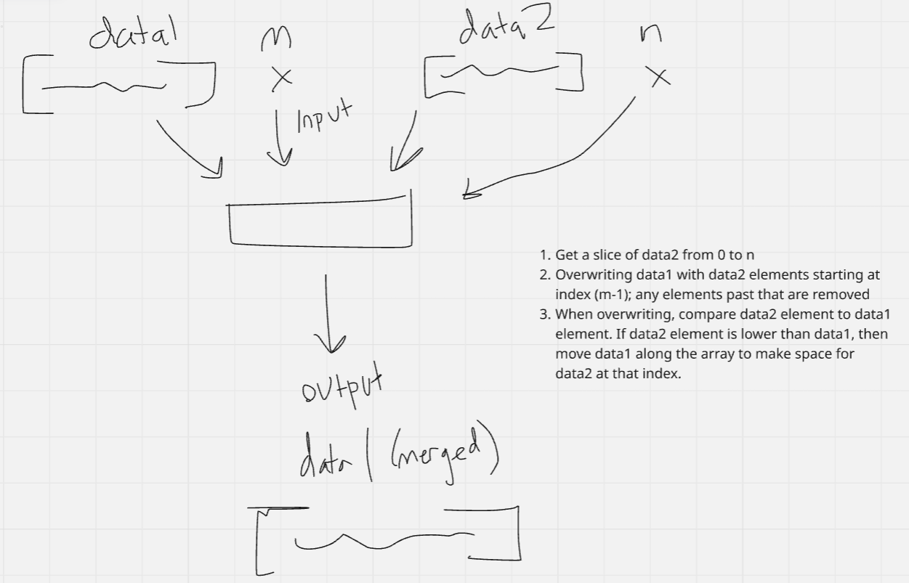

# Week 2: Merging Customer Data for Market Analysis

## Clarifying Questions
1. How should I handle cases where m and n are greater than array lengths?
2. Are there specific edge cases that I should consider?
3. What is the goal for time and space complexity?

## Complexity
**Time:** O(n^2)
**Space:** O(n)

## Tests Passed

## Diagram
