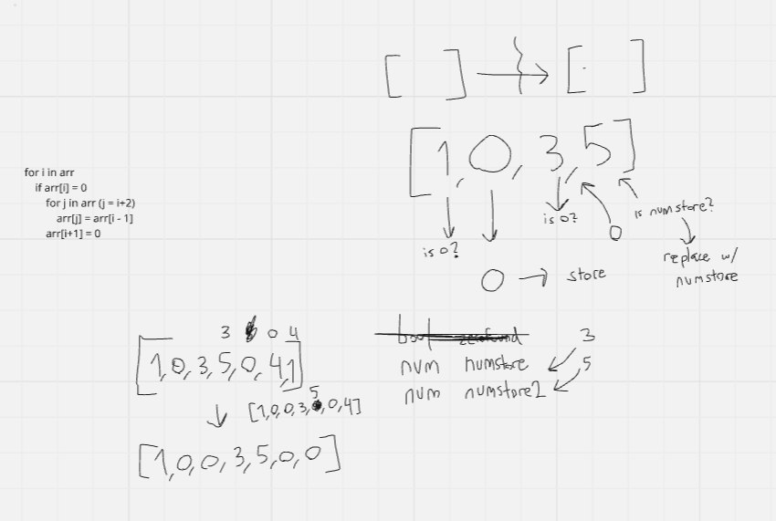

# Week 3: TextWise Solutions

## Clarifying Questions
1. What is the input and output?
2. Are there specific edge cases that I should consider?
3. Are there a specific number of parameters needed for the recursive function?

## Complexity
**Time:** O(n^2)
**Space:** O(n)

