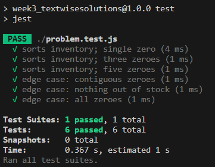

# Week 4: Inventory Management System Update

## Clarifying Questions
1. What is the maximum I can expect for inventory items in an array?
2. Are there specific edge cases that I should consider?
3. What is the goal for time and space complexity?

## Complexity
**Time:** O(n^2)
**Space:** O(n)

## Tests Passed

## Diagram
