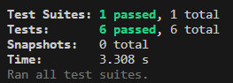
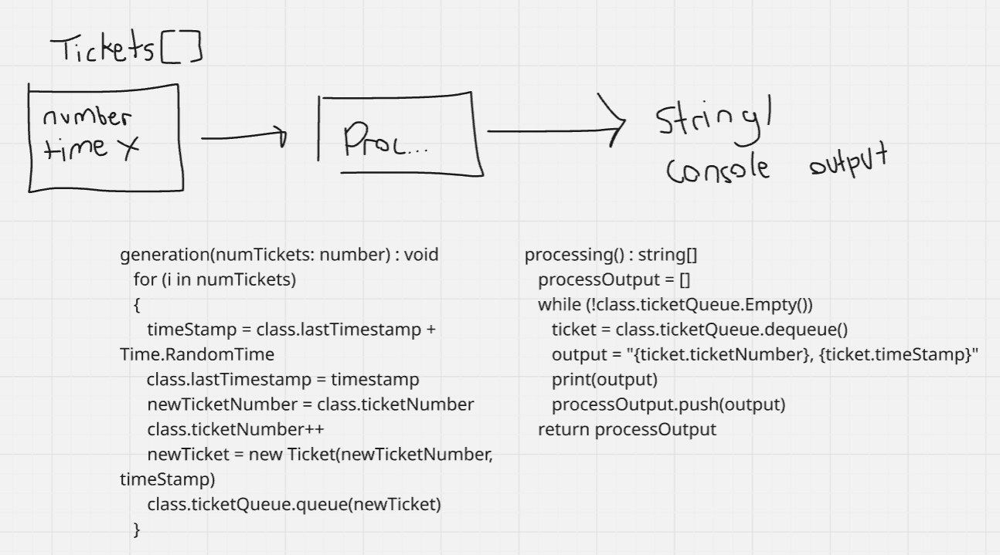

# Week 5: Ticketing System Solution

## Clarifying Questions
1. What is my expected input and output?
2. Are there specific edge cases that I should consider?
3. What is the goal for time and space complexity?

## Complexity
**Time:** O(n)
**Space:** O(n)

## Tests Passed

## Diagram
