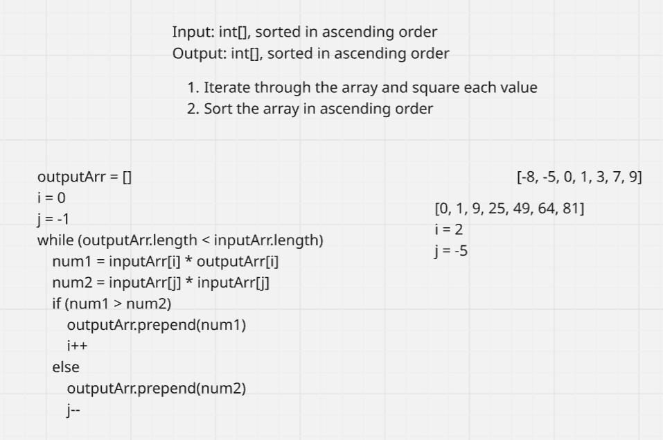

# Week 6: Analyzing Financial Growth Trends

## Clarifying Questions
1. Is it ideal for the algorithm to modify the array in place?
2. Are there specific edge cases that I should consider?
3. What is the goal for time and space complexity?

## Complexity
**Time:** O(n^2)
**Space:** O(n)

## Tests Passed

## Diagram
