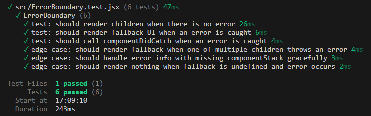

# Week 10 : Building an Application Safety Net with Error Boundaries in React

## To Run / Test

### To Run

Run `npm run dev` in the console, then navigate to `localhost:5173` in your browser.

### To Test

Run `npm run test` in the console.

## Tests

