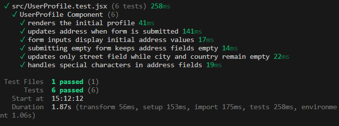

# Week 2: Managing Nested State in React

## To Run / Test

### To Run

Run `npm run dev` in the console, then navigate to `localhost:5174` in your browser.

### To Test

Run `npm run test` in the console.

## Tests

