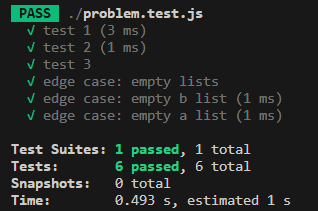
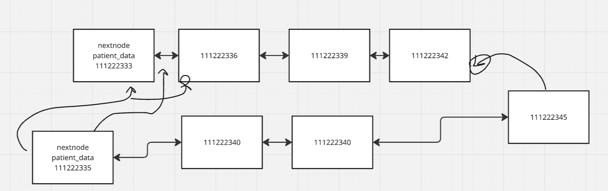

# Week 6: X

## Clarifying Questions

1. Is there a solution that doesn't use nested loops?
2. Are the metrics only going to be numbers?
3. What is the goal for time and space complexity?

## Complexity

**Time:** O(n log(n))
**Space:** O(n)

## Tests Passed

## Diagram

