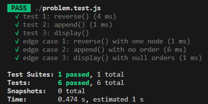
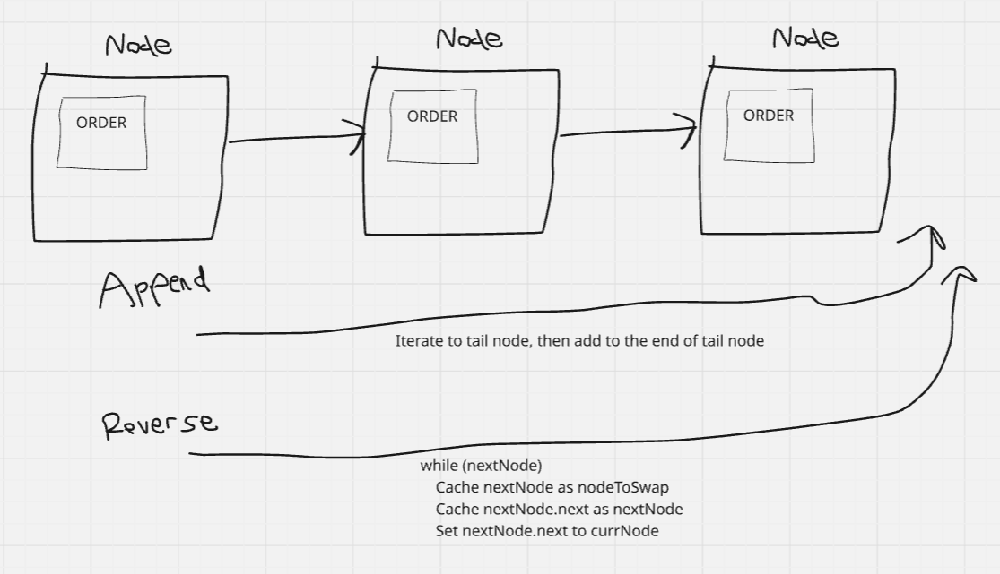

# Week 7: E-Commerce Order Processing System

## Clarifying Questions

1. Is there a preference for how orders should be displayed when calling display()?
2. How should nodes with no orders be handled?
3. What is the goal for time and space complexity for reverse()?

## Complexity

### Append()

**Time:** O(n)
**Space:** O(n)

### Display()

**Time:** O(n)
**Space:** O(n)

### Reverse()

**Time:** O(n)
**Space:** O(1)

## Tests Passed

## Diagram

